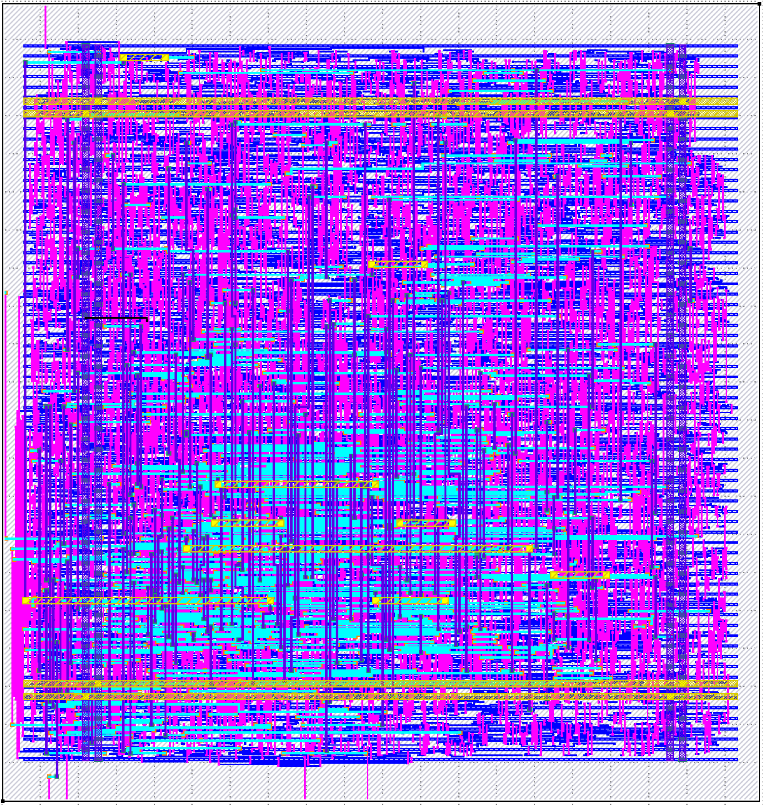

# cpu

[Documentation](https://bsod2528.github.io/pages/projects/vr16.html) | [Blogs](https://bsod2528.github.io/pages/tags.html#cpu-dev---4)

VR16 is a basic RISC processor designed and written in Verilog & SystemVerilog. To simulate computation hierarchy an assembler and compiler have been written in Python.

<div align="center">
  
  <br>
  <i>GDS viewed in Klayout</i>
</div>

## Features
- Single-stage, multi-cycle CPU
- 16-bit instructions
- 4 general purpose registers (r0, r1, r2, r3)
- Runs on a custom ISA: [VR16 ISA](ISA.md)
- `VRASM` for assembly, `VRScript` for higher-level code

## Setup

Python (assembler/compiler/scripts)
```sh
$ python3 -m venv env
$ source env/bin/activate
$ pip install -r requirements.txt
```

RTL simulation additionally requires `iverilog` and `gtkwave`. If you only need the toolchain (`VRASM`/`VRScript`), the Python setup above is sufficient.

To view the GDS output once librelane's run is done, ensure `klayout` is installed.

## Quickstart

```sh
# 1. Compile VRScript -> ASM
$ PYTHONPATH=src python3 -m compiler examples/vrscript/add.vrs examples/vr-asm/compiled.asm

# 2. Assemble ASM -> machine code
$ PYTHONPATH=src python3 -m assembler examples/vr-asm/compiled.asm mem/imem.mem

# 3. Simulate
$ ./compile.sh
$ ./sim.sh

# 4. Generate GDSII once with simulation
$ librelane --dockerized config.json
```

Expected outputs: `mem/imem.mem`, `output.out`, `dump.vcd`, and `runs/<date_time>`

## Verification

```sh
# Python testbenches
$ pytest src/frontend/tb/test_*.py

# RTL simulation
$ ./compile.sh && ./sim.sh
```

## Troubleshooting

| Issue | Cause | Fix |
|---|---|---|
| `ModuleNotFoundError` | `src/` not on `PYTHONPATH` | Prefix commands with `PYTHONPATH=src` |
| `iverilog`/`gtkwave` not found | Not installed | Install both, verify with `iverilog -V` / `gtkwave --version` |
| `sim.sh` fails, missing `output.out` | `compile.sh` wasn't run first | Run `./compile.sh` before `./sim.sh` |
| `mem/imem.mem` empty/unchanged | Malformed `start:`/`end:` in ASM | Ensure a valid `start:`...`end:` block with instructions |
| GTKWave not updating | Missing `$dumpfile`/`$dumpvar` | Add both to your testbench |

## Road-Map

- [x] Basic CPU
- [x] Physical design
- [ ] Make CPU programmable and produce GDS

See [CHANGELOG](./CHANGELOG.md) for detailed commit history.

## Licensing

See [LICENSES.md](./LICENSES.md).
